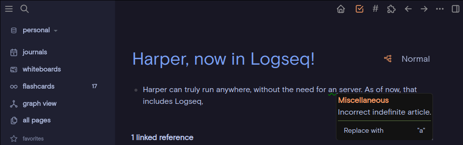

# `logseq-plugin-harper`

The [Harper](https://writewithharper.com/) [Logseq](https://logseq.com/) plugin is a powerful, privacy-first grammar and spell-checking tool designed specifically for Obsidian users. Unlike many other grammar checkers, Harper operates entirely offline, ensuring your data remains secure while providing real-time, high-performance corrections. This plugin is ideal for writers, academics, and developers who value privacy and efficiency in their workflows.

Unlike other offerings (like Grammarly) Harper explicitly ignores the contents of code fences and inline code blocks.

## Key Features

- Linting diagnostics in edit mode
- Context menu to view and apply suggestions
- Integration with user defined dictionary
- Toggle all lint rules from configuration page

## Installation Guide

1. Open Logseq and navigate to **... → Plugins → Market Place**.
2. Search for "Harper" in the plugin library.
3. Click "Install"
4. Start typing in your notes—Harper will automatically highlight errors as you go!

> **Warning**
> Harper expects an up-to-date version of Electron. If you have issues, [reinstall Logseq](https://logseq.com/downloads) or otherwise update your Electron version.

## Future Development

I welcome feedback and [contributions from the community](https://github.com/theoreticallyjosh/logseq-harper-plugin). Planned updates include:

- Adding words to dictionary from the UI
- Linting diagnostics in non edit view

## I have a problem or feature request...

Let me know if you have any problems, feature requests, or feedback of any kind by filling out an [issue on the main repository](https://github.com/theoreticallyjosh/logseq-plugin-harper).
